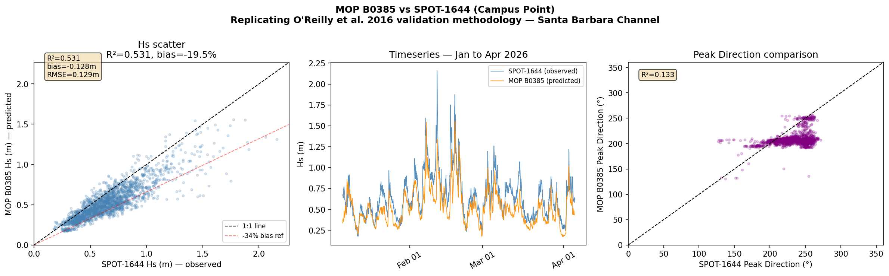
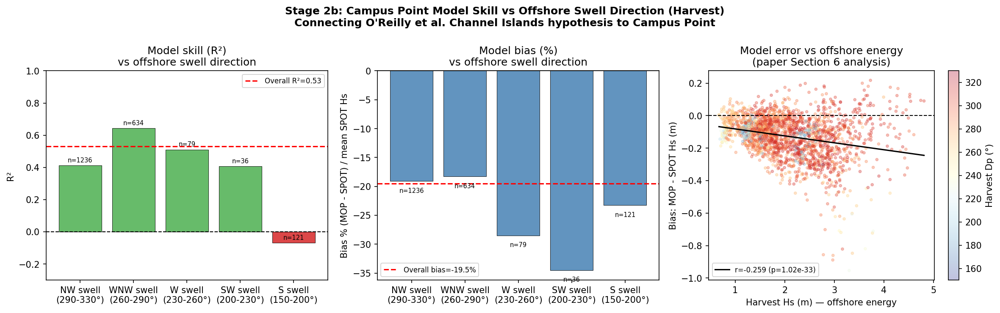
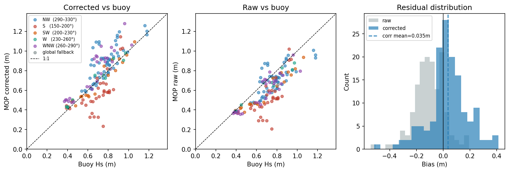
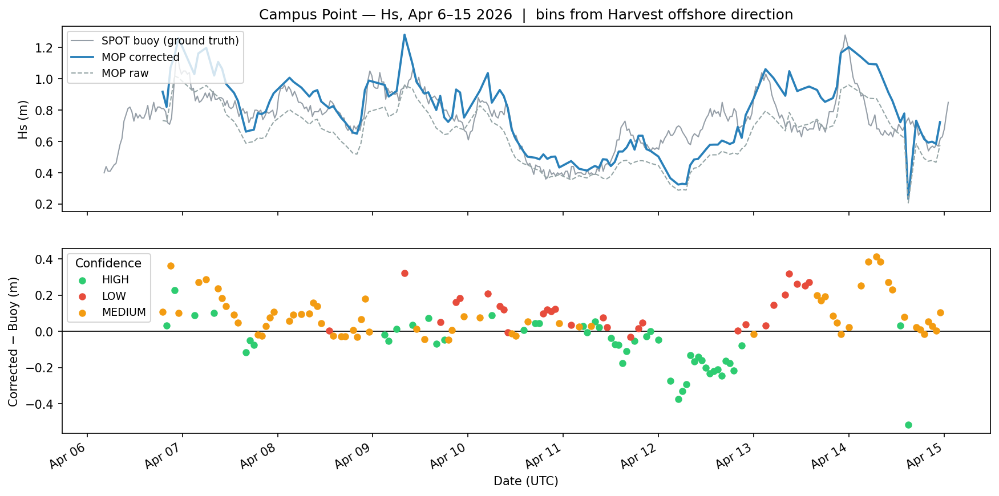
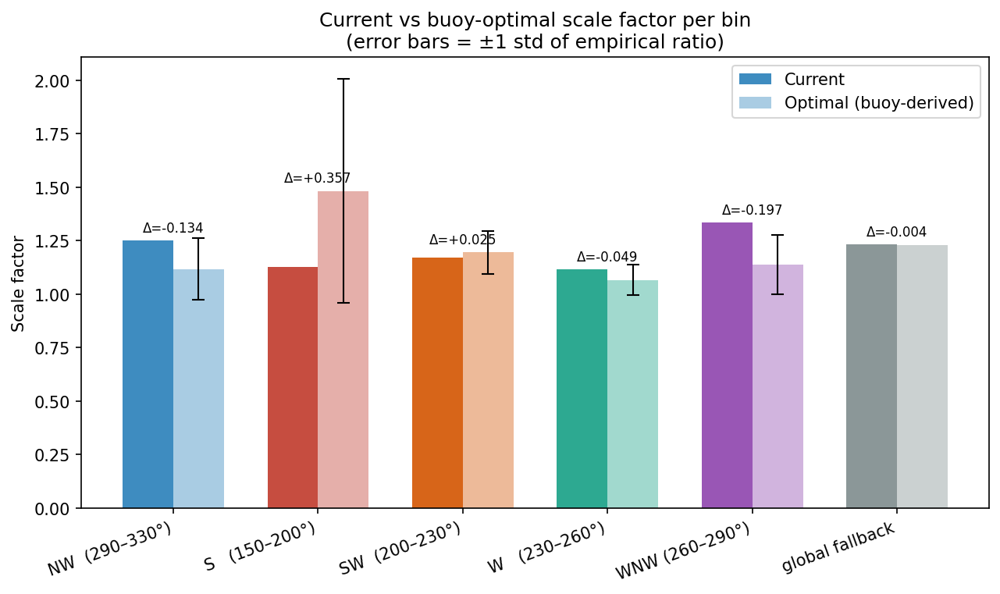

# Campus Point Wave Forecast

Campus Point is a reef break on the UCSB campus. Surfers and researchers there currently rely on CDIP's publicly available MOP wave model for forecasts — a  nearshore model that has been running since the early 2000s. The model is well-validated regionally, but O'Reilly et al. (2016), who built it, specifically flagged the Santa Barbara Channel as one of the hardest stretches of the coast to model accurately. The Channel Islands sit directly offshore, breaking up incoming swell through a combination of refraction, diffraction, and shadowing that the model's linear wave physics cannot fully capture.

The question this project set out to answer: how large is that error at Campus Point specifically, does it depend on swell direction in the way the theory predicts, and can an empirical correction reduce it enough to be useful in a real-time forecast?

To answer it, we're using a buoy that Nick Nidzieko's lab at UCSB deployed near Campus Point in March 2025. Using a year's worth of 30-minute wave observations, I validate the model rigorously, stratify its errors by offshore swell direction, and train a correction. The result: MOP underpredicts wave height at Campus Point by approximately 20%, the error is direction-dependent, caused by wave shadowing from the Channel Islands, and largest during the high-energy northwest swells that matter most for surf prediction. This repository documents that analysis and runs a live hourly forecast that applies it — currently a direction-bin lookup table, with a Ridge regression running alongside it that refits each hour as new buoy observations accumulate. 

This is a work in progress: the correction improves as more paired data comes in, and the analysis notebooks reflect my current thought process as to how we can get more people out there surfing 🏄 🤙.

---

## Finding

The MOP model consistently underpredicts Hs at Campus Point. Across ~6,000 hours of matched model/buoy pairs (March 2025 – April 2026):

| Metric | Uncorrected MOP | After correction |
|---|---|---|
| Mean bias | −19.9% | +1.5% |
| R² | 0.415 | 0.582 |



*Left: MOP predicted vs SPOT-1644 observed Hs. Nearly every point falls below the 1:1 line. Center: hourly time series — the model tracks swell timing correctly but runs consistently low, with the biggest gaps during large swell events. Right: peak direction comparison — MOP collapses the directional spread that the buoy resolves.*

The bias is not uniform. It depends on the direction incoming swell is arriving from offshore:

| Offshore swell direction (Harvest buoy) | R² | Notes |
|---|---|---|
| WNW 260–290° | 0.644 | Best skill |
| NW 290–330° | 0.41 | Moderate skill |
| W 230–260° | 0.26 | Degraded |
| SW 200–230° | 0.39 | Moderate |
| S 150–200° | −0.07 | No skill |



*Left: R² by Harvest offshore direction — skill ranges from 0.64 for WNW swell to −0.07 for south swell. Center: bias % by direction — the ~20% underprediction is consistent across all bins. Right: model error grows with offshore wave energy (r=−0.26, p<0.001), the signature of Channel Islands blocking that the linear refraction model cannot capture.*

South and southwest swells have traveled through Channel Islands gaps and arrived via diffraction. Northwest swells arrive more directly and are predicted better. This matches the diagnostic framework of O'Reilly et al. (2016), who identified the Santa Barbara Channel as one of the most difficult stretches of the California coast to model for this reason.

---

## Data Sources

| Source | What it provides | Role |
|---|---|---|
| **Sofar SPOT-1644** | Hs, Tp, Dp every ~30 min at Campus Point (34.40°N 119.85°W) | Ground truth for bias quantification and model training |
| **CDIP MOP B0385** | Hourly Hs hindcast + nowcast at 10m depth, Campus Point | Raw forecast being corrected |
| **CDIP Harvest (071p1)** | Hs, Dp, Tp at 548m depth, offshore northwest of Channel Islands | Offshore swell direction used to select the correction bin |

The SPOT-1644 buoy was deployed by Nick Nidzieko's lab at UCSB. MOP and Harvest are accessed live via CDIP's THREDDS/OPeNDAP server. No local copies of model data are stored in this repository.

---

## Data Pipeline

```
┌──────────────────────┐     ┌──────────────────────┐     ┌──────────────────────┐
│  Harvest buoy (071)  │     │  MOP B0385 nowcast   │     │  SPOT-1644 buoy      │
│  OPeNDAP stream      │     │  OPeNDAP stream      │     │  Sofar download API  │
│  → Hs, Dp, flag      │     │  → Hs, time          │     │  → Hs, Tp, Dp        │
└──────────┬───────────┘     └──────────┬───────────┘     └──────────┬───────────┘
           │                            │                             │
           │  most recent QC-flagged=1  │  most recent valid Hs      │  most recent obs
           ▼                            ▼                             ▼
    Dp_harvest                      Hs_mop_raw                  buoy obs (optional)
           │                            │
           │  lookup in campus_point_correction.json
           └──────────────┬─────────────┘
                          │
                    Hs_corrected
                    confidence flag (HIGH / MEDIUM / LOW)
                    direction bin label
                          │
                    ┌─────┴──────┐
                    │            │
             forecast_output.json   forecast_log.csv
             (current forecast)      (append-only log)
```

**Input data:**
- Harvest: `waveHs`, `waveDp`, `waveFlagPrimary` — only flag=1 (QC-passed) samples used
- MOP: `waveHs`, `waveTime` — filtered to physically plausible range (0–20m)
- SPOT-1644: `Significant Wave Height (m)`, `Peak Period (s)`, `Peak Direction (deg)` — rows with missing values dropped before parsing

**Correction step:**
Harvest `Dp` is compared against five direction bin edges (150–330°). The matching scale factor from `campus_point_correction.json` is multiplied against `Hs_mop_raw` to produce `Hs_corrected`. If `Dp` falls outside all defined bins, a global fallback factor of 1.233 is used with LOW confidence.

**Output:**
`forecast_output.json` is written each run and committed to the repository. `forecast_log.csv` accumulates one row per hour, including the raw MOP, corrected value, Harvest state, SPOT observation (when available), and the Ridge regression prediction.

---

## Bias Correction

### Direction-bin lookup table (`campus_point_correction.json`)

Scale factors are ratios of mean observed SPOT Hs to mean MOP Hs, computed per offshore direction bin on training data (March–November 2025, n=5,978 hours). At forecast time, `Hs_corrected = Hs_mop × factor[bin]`.

| Bin | Scale factor | R² | Confidence |
|---|---|---|---|
| NW 290–330° | 1.1175 | 0.31 | MEDIUM |
| WNW 260–290° | 1.1382 | −0.15 | LOW |
| W 230–260° | 1.0669 | 0.26 | MEDIUM |
| SW 200–230° | 1.1951 | 0.39 | HIGH |
| S 150–200° | 1.1260 | 0.48 | HIGH |
| Global fallback | 1.2333 | — | LOW |

The confidence flag reflects R² on held-out test data (December 2025 – April 2026). WNW carries LOW confidence despite the best historical R² because validation showed unstable scale factors. S/SW carry HIGH confidence because the scale factor is consistent across the validation period, even though the underlying model has poor skill — the correction is reliable even when the model is not.



*Left: corrected MOP vs SPOT-1644 (colors = direction bin). Center: uncorrected MOP vs SPOT-1644 — points systematically below the 1:1 line. Right: residual distributions — the correction shifts the mean from −0.13m to near zero.*

The correction was validated against a 10-day live window (Apr 6–15 2026) where SPOT-1644 observations were withheld from training:



*Top: SPOT buoy (ground truth), corrected MOP, and raw MOP over Apr 6–15 2026. Bottom: residual (corrected − buoy) colored by confidence flag. NW and WNW bins overcorrect modestly; S/SW bins perform well, consistent with their HIGH confidence rating.*

The current scale factors were derived from ~6,000 training hours. The validation window reveals where they can improve:



*The deployed scale factor (dark bar) vs the buoy-optimal ratio ± 1 std (light bar + error bars) computed from the validation window. NW and WNW bins are overcorrecting; more live paired observations will tighten these estimates.*

### Ridge regression (`model.py`) — active, accumulating

The lookup table is a fixed artifact derived from historical data. Alongside it, a Ridge regression is running live and improving with every hourly forecast cycle. Features: `Hs_mop_raw`, `Harvest_Hs`, `sin(harvest_Dp)`, `cos(harvest_Dp)` (and `harvest_Tp` once enough live data accumulates). Target: `buoy_Hs`.

```
w = (X'X + αI)⁻¹ X'y     α = 1.0
```

Direction enters as sin/cos components so the model learns a smooth directional response rather than treating bins as unordered categories — which matters because the Channel Islands shadowing effect is a continuous function of angle, not a step function at bin edges.

Each run, the model reloads its saved weights, combines the historical seed data with any new live paired observations from `forecast_log.csv`, and refits. Minimum 30 paired rows required before the model is used; beyond that it updates automatically. The model is currently fit on 142 observations. As the SPOT buoy continues logging and the forecast log accumulates more matched pairs, the Ridge prediction will become the primary correction and the lookup table will serve as a fallback for days when the buoy is offline.

---

## Automation

A GitHub Actions workflow (`.github/workflows/forecast.yml`) runs `forecast.py` every hour at `:00`. On each run:

1. Fetch Harvest and MOP from CDIP THREDDS
2. Fetch SPOT-1644 from Sofar API (skipped gracefully on failure)
3. Refit Ridge regression if enough paired data is available
4. Apply lookup table correction
5. Write `forecast_output.json` and append to `forecast_log.csv`
6. Commit and push both files

The workflow requires `write` permission on `contents` and runs on `ubuntu-latest` with Python 3.11.

---

## Repository Structure

```
.
├── forecast.py                      # Main script: fetch, correct, log
├── model.py                         # Ridge regression model class
├── campus_point_correction.json     # Direction-bin scale factors (lookup table)
├── model_state.json                 # Persisted Ridge weights and fit metadata
├── forecast_output.json             # Latest forecast (updated hourly)
├── forecast_log.csv                 # Append-only log of all forecast runs
│
├── bias_correction.ipynb            # Full analysis: bias quantification, train/test
│                                    #   split, scale factor derivation (O'Reilly metrics)
├── campus_point.ipynb               # Initial validation: MOP vs SPOT-1644, 3 months
├── validation_initial_scalefactors.ipynb  # Validation of correction against live data
├── cdip_visualizer.ipynb            # Exploratory: CDIP spectra and directional plots
│
├── data/                            # Monthly SPOT-1644 CSV downloads (Mar 2025–Apr 2026)
├── winter_26_data/                  # SPOT-1644 CSVs for Jan–Apr 2026 validation period
├── val_check_1/                     # Validation snapshot: forecast log, buoy history,
│                                    #   seed data for Ridge regression bootstrap
│
└── img/                             # Figures exported from notebooks
    ├── mop_vs_spot_validation.png           # Scatter + timeseries: MOP vs SPOT-1644
    ├── stage2b_offshore_direction.png       # Skill/bias/energy vs offshore direction
    ├── corrected_vs_buoy_summary.png        # Correction improvement: scatter + residuals
    ├── hs_timeseries_bias_confidence.png    # Live 10-day validation with confidence flags
    ├── scale_factor_current_vs_optimal_bars.png  # Deployed vs optimal scale factors
    ├── bias_by_direction.png                # Bias % by arrival direction at Campus Point
    ├── direction_bias.png                   # Direction distribution + bias scatter
    ├── mean_bias_by_bin.png                 # Mean corrected bias per direction bin
    ├── abs_bias_vs_rmse_by_bin.png          # |Bias| vs RMSE per bin
    ├── per_bin_corrected_vs_buoy.png        # Corrected vs buoy scatter, per bin
    ├── per_bin_residual_vs_hs.png           # Residual vs Hs magnitude, per bin
    ├── residual_by_direction_bin.png        # Residual time series coloured by bin
    ├── residual_by_hour.png                 # Residual vs hour of day
    ├── residual_vs_harvest_hs.png           # Residual vs offshore Hs
    ├── residual_vs_hs_magnitude.png         # Residual vs local Hs magnitude
    ├── scale_factor_optimal_with_std.png    # Optimal scale factor ± 1 std per bin
    ├── harvest_vs_camp_pendleton.png        # Spectrogram: Harvest vs Camp Pendleton
    ├── spectrogram_071.png                  # Harvest wave energy spectrogram (30 days)
    ├── spectrogram_191.png                  # Campus Point spectrogram
    └── directional_spectrum_march6.png      # Directional spectrum, March 6 swell event
```

---

## Methodology Reference

O'Reilly, W. C., Olfe, C. B., Thomas, J., Seymour, R. J., & Guza, R. T. (2016). The California coastal wave monitoring and prediction system. *Coastal Engineering*, 116, 118–132.

The skill metrics used throughout (`bias`, `RMSE`, `R²` via Eq. 7 of that paper) and the directional stratification approach follow this reference. The finding that Campus Point errors are tied to offshore swell direction at Harvest is a direct empirical test of the paper's qualitative diagnosis of Santa Barbara Channel modeling difficulty.

---

## Dependencies

```
numpy
pandas
xarray
pydap        # OPeNDAP client for CDIP THREDDS
scipy
requests
```
